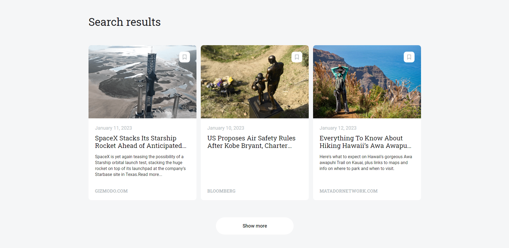

# Final Project at Practicum

# News Explorer Service App 📰🌐🗺️

## **Developed By Chen Abudi** 👩🏽‍💻

## 📢 Overview

- Intro
- Technologies & Techniques
- Live Project
- Additional Links
- Possible Improvements
- All Project Features

## 🔎 Intro

This is the Frontend of a News Explorer Service App, where users can search for news articles worldwide and save them to their own accounts. The app developed with React.

## 🛠️ Technologies & Techniques

- ReactJS
- JavaScript
- CSS3
- React Router Dom
- Responsive Layout
- JWT server Auth
- newsapi.org - provides articles news
- Deployed to _`Vercel`_
- CI/CD
- `Vercel Serverless technology`
- Git/GitHub

| NPM Packages (Backend)               |                                                                          Aspects of Use |
| :----------------------------------- | --------------------------------------------------------------------------------------: |
| bcryptjs                             |                                                                     Password Encryption |
| body-parser                          | Returns middlewares that handle incoming requests before they reach a target controller |
| celebrate                            |                                Express middleware that wraps the Joi validation library |
| cors (Cross-Origin Resource Sharing) |                                             Secure cross-origin requests to your server |
| dotenv                               |                                          Loads environment variables from a `.env` file |
| express-winston                      |                                                Middleware for request and error logging |
| winston                              |                                      Universal logging library with multiple transports |
| validator                            |                                                        String validators and sanitizers |
| jsonwebtoken                         |                              Securely transfers data within parties using a JSON object |
| express-rate-limit                   |                                        Limit repeated requests to public APIs/endpoints |
| helmet                               |                                                   Secures Express apps via HTTP headers |

## 📍 API Endpoints :

| RESTful API Endpoints | HTTP Methods |                  Usage Purpose |
| --------------------- | :----------: | -----------------------------: |
| /signup               |     POST     |              User Registration |
| /signin               |     POST     |                     User Login |
| /users/me             |     GET      |              GETting user data |
| /articles             |     GET      | GETting data from all articles |
| /articles             |     POST     |         Creating a new article |
| /articles/:\_id       |    DELETE    |    DELETE an article by its id |

---

# ✨ Live App

**_Visit the App_** [👉🏽 **HERE!**](https://news-explorer-frontend-alpha.vercel.app/)

---

# 👩🏽‍💻👨🏽‍💻 How to Get Started

## Prerequisites:

> [!IMPORTANT]
> This project requires **Node.js v22.x** and **npm v9.x** or higher. Please ensure you have the correct versions installed before running or building the app.

> [!TIP]
> Use `nvm` (Node Version Manager) to easily switch between Node.js versions:
>
> ```
> nvm install 22
> nvm use 22
> ```

### **Clone**

`$ git clone https://github.com/Chen-Abudi/news-explorer-frontend.git`

### **Install**

`$ cd news-explorer-frontend`

`$ npm i or npm install`

### **Launch**

`$ npm run start`

---

## 💎 Valuable Links :

- [Backend API](https://news-explorer-api-mu.vercel.app/)

- [Backend Repo](https://github.com/Chen-Abudi/news-explorer-api)

## **Enjoy ! 🌺👋🏽**

## 📸 Project Features :

- **_Homepage for users before sign up/sign in_**

  

- **_Homepage for user who's logged in_**

  

- **_Sign up_**

  

- **_Sign in/Log in_**

  

- **_Form Validation_**

  

- **_Search results for articles_**

  

- **Articles**

  - **_Marked icon which means the article got saved to profile_**

    

  - **_Remove article from the saved ones_**

    

  - **_When users aren't logged in and wants to save an article, they will need to sign in first_**

    

- **_When there's no match for searching terms, not found results will be shown_**

  

- **_The saved articles page in users account/profile_**

  

- **_Info about the author section_**

  

---

## 🔧 Possible Future Improvements

- [ ] Create a Forgot Password option in case the users forget theirs.
- [ ] Resets Password
- [ ] Customize news outlet filtration according to user preferences.
- [ ] Customize the sorting of saved articles based on user preferences.
- [ ] Adjust the application for a dark/night mode.

---
